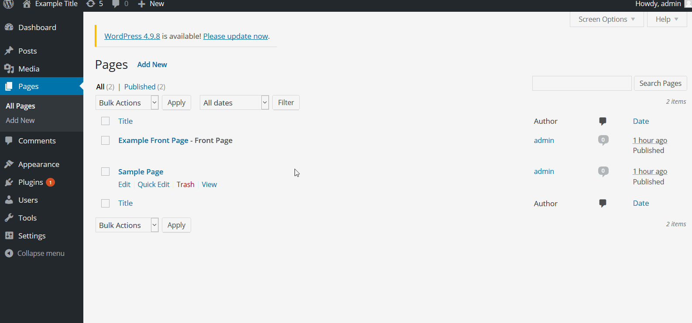

# Project 7 - WordPress Pentesting

Time spent: **10** hours spent in total

> Objective: Find, analyze, recreate, and document **five vulnerabilities** affecting an old version of WordPress

## Pentesting Report

1. (Required) Unauthenticated Stored Cross-Site Scripting (XSS)
  - [ ] Summary: The MySQL TEXT type has a size limit of 64 kilobytes. A large comment will be truncated, resulting in malformed HTML tags.
    - Vulnerability types: XSS
    - Tested in version: 4.2
    - Fixed in version: 4.2.1
  - [ ] GIF Walkthrough: 
  - [ ] Steps to recreate: Copy text from USXSS.txt and paste into comment area. Then post the comment. Wait for a user to view it.
2. (Required) Authenticated Stored Cross-Site Scripting (XSS)
  - [ ] Summary: An attacker with posting capabilities can insert specially formatted HTML containing JavaScript to compromise the website.
    - Vulnerability types: XSS
    - Tested in version: 4.2
    - Fixed in version: 4.2.3
  - [ ] GIF Walkthrough: 
  - [ ] Steps to recreate: Create a new page and add ``<a href="[caption code=">]</a><a title=" onmouseover=alert('test')  ">Hello World XSS</a>`` to the body.
3. (Required) Authenticated Shortcode Tags Cross-Site Scripting (XSS)
  - [ ] Summary: An attacker can cause attributes in HTML elements to close prematurely by using shortcodes. This will lead to the execution of the scripts in the attributes.
    - Vulnerability types: XSS
    - Tested in version: 4.2
    - Fixed in version: 4.2.5
  - [ ] GIF Walkthrough: 
  - [ ] Steps to recreate: Create a new page and add ``Link[caption width="1" caption='<a href="' ">]</a><a href="http://onMouseOver='alert(1)'">Hello World XSS</a>`` to the body.
4. (Optional) User Enumeration
  - [ ] Summary: An attacker can enumerate through all the usernames since the webpage doesn't protect the usernames.
    - Vulnerability types: User Enumeration
    - Tested in version: 4.2
    - Fixed in version: N/A
  - [ ] GIF Walkthrough:  
  - [ ] Steps to recreate: Run ``wpscan --url http://wpdistillery.vm --enumerate u`` in the terminal.
5. (Optional) Stored XSS
  - [ ] Summary: An attacker can inject a malicious iframe to compromise the webpage.
    - Vulnerability types: XSS
    - Tested in version: 4.2
    - Fixed in version: 4.2.1
  - [ ] GIF Walkthrough: 
  - [ ] Steps to recreate: Edit the title page and inject ``<iframe src = 'abc.com' onload = alert('test')> </iframe>`` to the body. Then view the new page.

## Assets

List any additional assets, such as scripts or files
1. USXSS.txt
## Resources

- [WordPress Source Browser](https://core.trac.wordpress.org/browser/)
- [WordPress Developer Reference](https://developer.wordpress.org/reference/)

GIFs created with [LiceCap](http://www.cockos.com/licecap/).

## Notes

Describe any challenges encountered while doing the work

## License

    Copyright [2018] [Michael Li]

    Licensed under the Apache License, Version 2.0 (the "License");
    you may not use this file except in compliance with the License.
    You may obtain a copy of the License at

        http://www.apache.org/licenses/LICENSE-2.0

    Unless required by applicable law or agreed to in writing, software
    distributed under the License is distributed on an "AS IS" BASIS,
    WITHOUT WARRANTIES OR CONDITIONS OF ANY KIND, either express or implied.
    See the License for the specific language governing permissions and
    limitations under the License.
